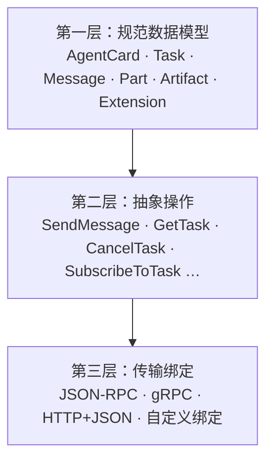
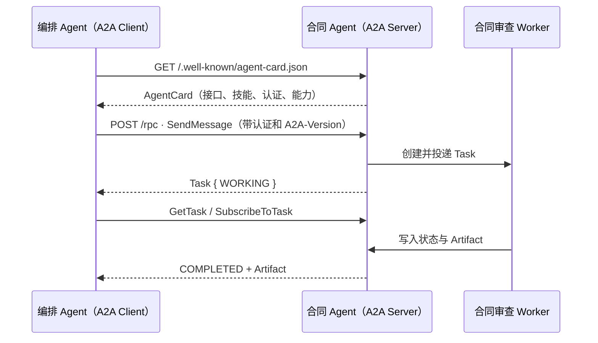

> 本文面向第一次接触 A2A 的开发者。示例基于 A2A **v1.0** 的规范；具体字段与 SDK 以权威的 [https://github.com/a2aproject/A2A/blob/main/specification/a2a.proto](https://github.com/a2aproject/A2A/blob/main/specification/a2a.proto) 为准。

## 先给结论

**A2A（Agent2Agent）是让独立 AI Agent 服务彼此发现、调用和协作的开放协议。**

它解决的不是“模型怎样调用一个函数”，而是“一个 Agent 如何把一项可能耗时、需要补充信息或审批的任务，交给另一个黑盒 Agent，并可靠地取得结果”。调用两端可以使用不同的模型、语言、框架和部署环境。

如果你有一个由其他团队、其他系统或其他组织调用的专业 Agent 服务，A2A 值得作为对外接口；若只是同一进程内的几个函数或简单工具调用，A2A 往往是额外负担。

---

## 一、A2A 是什么，谁发起，解决什么问题？

### 1.1 定义与边界

A2A 是 **Agent 应用之间** 的互操作协议。它允许一个调用方（A2A Client，可以是另一个 Agent 或普通应用）与一个远程 Agent（A2A Server）交互，而无需了解后者的：

- 使用哪个大模型；
- 内部 Prompt、记忆、规划方式；
- 内部工具与实现语言；
- 运行在哪个 Agent 框架中。

双方只交换公开的能力说明、任务消息、任务状态和产物。因此 A2A 的关键词是：**能力发现、任务委派、异步状态、多轮协作和安全边界**。

它不是模型协议。GPT、Claude、Gemini 或本地模型并不会“直接说 A2A”；你在它们外面构建的 Agent 应用实现 A2A Client 或 A2A Server。

### 1.2 来源与现状

A2A 最初由 Google 开发，后捐赠给 Linux Foundation；当前由来自 Google、IBM Research、Microsoft、AWS、SAP、Salesforce、ServiceNow、Cisco 等组织参与的技术治理机制维护。最新发布规范为 v1.0。[https://a2a-protocol.org/latest/](https://a2a-protocol.org/latest/) [https://a2a-protocol.org/latest/specification/](https://a2a-protocol.org/latest/specification/)

### 1.3 它与 MCP、Agent 框架的关系

| 层次 | 负责什么 | 例子 |
|---|---|---|
| 模型 | 推理和生成 | GPT、Claude、Gemini、本地模型 |
| Agent 框架 | Agent 内部规划、记忆、子 Agent、重试 | LangGraph、ADK、CrewAI、自研编排器 |
| MCP | Agent 访问工具、数据和资源 | GitHub、数据库、搜索、CRM |
| **A2A** | 独立 Agent 服务之间协作 | 研究 Agent 调用合同审查 Agent |

一个常见组合是：编排 Agent 用 A2A 把合同审查委派给法务 Agent；法务 Agent 再在**内部**用 MCP 查询条款库、客户资料与政策文档。

```text
编排 Agent ── A2A ──> 合同审查 Agent ── MCP ──> 条款库 / CRM / 文档库
```

A2A 不替代 MCP，也不规定 Agent 内部的子 Agent 如何工作；这两件事分别应使用 MCP 或你选择的 Agent 框架。[https://a2a-protocol.org/latest/](https://a2a-protocol.org/latest/)

---

## 二、何时推荐使用 A2A，何时不推荐？

### 2.1 推荐

当下列情况成立时，A2A 能降低长期集成成本：

- <span style="display:inline;color:#35b378;font-weight:bold;">独立服务边界</span><span style="display:inline;color:#3f3f3f;font-weight:normal;">：专业 Agent 是独立进程、容器、服务或团队所有的模块。</span>
- <span style="display:inline;color:#35b378;font-weight:bold;">异构生态</span><span style="display:inline;color:#3f3f3f;font-weight:normal;">：调用方和被调用方可能使用不同模型、语言、框架或供应商。</span>
- <span style="display:inline;color:#35b378;font-weight:bold;">任务不是一次函数调用</span><span style="display:inline;color:#3f3f3f;font-weight:normal;">：任务可能持续数秒至数天，需要进度、取消、断线恢复、补充信息或人工审批。</span>
- <span style="display:inline;color:#35b378;font-weight:bold;">能力需要被发现和替换</span><span style="display:inline;color:#3f3f3f;font-weight:normal;">：希望编排器根据 Agent Card 选择合适 Agent，或未来替换某个 Agent 而不改上游接口。</span>
- <span style="display:inline;color:#35b378;font-weight:bold;">跨信任边界</span><span style="display:inline;color:#3f3f3f;font-weight:normal;">：跨部门、跨租户、跨公司，需要清晰的认证、授权、审计和任务数据隔离。</span>
- <span style="display:inline;color:#35b378;font-weight:bold;">产物丰富</span><span style="display:inline;color:#3f3f3f;font-weight:normal;">：结果可能是 JSON、文件、图片、报告或分块流式内容，而非一小段文本。</span>

### 2.2 不推荐或暂不需要

以下场景优先使用普通函数调用、队列、REST/gRPC API、MCP 或框架原生子 Agent 能力：

- 所有“Agent”都在同一进程、同一代码库，且不会对外复用。
- 实际上是一个确定、无状态、短耗时的工具函数，例如“计算税率”“查一条数据库记录”。这更接近 MCP Tool 或普通 API。
- 你只需一个固定服务 URL，不需要发现、任务状态、多轮对话、流式或跨团队互操作。
- 项目还在验证核心业务价值阶段；此时先定义稳定的业务输入输出比先实现完整的协议层更重要。

实用判断题：**若调用方需要问“这个服务能做什么、是否接受我的输入、任务做到哪一步、能否补充信息或取消”，它更像 A2A Agent；若调用方只需“给参数、拿结果”，它更像工具。**

---

## 三、A2A 的三层结构

规范将互操作拆为三层，从而让传输方式变化时仍保持同一套业务语义。



### 3.1 第一层：规范数据模型

这一层定义“对象是什么意思”，与 HTTP、gRPC、JSON-RPC 无关。权威来源是 `a2a.proto`；SDK 或 JSON Schema 应由它生成，而不是手写一份相似但可能漂移的模型。[https://github.com/a2aproject/A2A/blob/main/docs/specification.md](https://github.com/a2aproject/A2A/blob/main/docs/specification.md)

| 对象 | 含义 | 你可以把它理解为 |
|---|---|---|
| `AgentCard` | Agent 的身份、能力、接口、认证、输入输出模式和技能 | 服务说明书 / Manifest |
| `Message` | Client 与 Agent 的一轮交互 | 一封任务信件 |
| `Part` | Message 或 Artifact 的内容块 | 文本、文件 URL/原始文件、结构化 JSON |
| `Task` | 有唯一 ID、可持续更新的工作单元 | 可追踪工单 |
| `Artifact` | Task 的交付物 | 报告、CSV、JSON、文件、图片 |
| `Extension` | 核心规范之外的协商能力 | 版本化插件能力 |
| `contextId` | 将相关 Task 和 Message 逻辑归组 | 会话 / 业务流程 ID |

`Task` 的典型状态为：

```text
SUBMITTED → WORKING → COMPLETED
                    ├→ FAILED
                    ├→ CANCELED
                    ├→ REJECTED
                    ├→ INPUT_REQUIRED  （等待补充信息）
                    └→ AUTH_REQUIRED   （等待授权/审批）
```

其中 `COMPLETED`、`FAILED`、`CANCELED`、`REJECTED` 是终态；`INPUT_REQUIRED` 和 `AUTH_REQUIRED` 是可恢复的中断状态。最终业务结果应以 `Artifact` 返回，而不是只混在对话 Message 中。

### 3.2 第二层：抽象操作

这一层定义客户端可以做什么，无论下层选 JSON-RPC、gRPC 还是 REST，语义都应一致。

| 操作 | 用途 |
|---|---|
| `SendMessage` | 新建任务或向已有 Task 补充信息；返回 Task 或直接 Message |
| `SendStreamingMessage` | 发起任务并实时接收状态和产物片段 |
| `GetTask` | 查询 Task 当前状态、产物和可选历史；也可用于轮询 |
| `ListTasks` | 按上下文、状态等列出当前调用方有权限查看的 Task |
| `CancelTask` | 请求取消一个仍在处理的 Task |
| `SubscribeToTask` | 对进行中的已有 Task 重新建立实时订阅 |
| Push notification 配置 | 为长任务登记一个 webhook，由服务端主动通知 |
| `GetExtendedAgentCard` | 已认证调用方获取更详细或权限更高的能力说明 |

`SendMessage` 对简单任务可以直接返回一条 `Message`；但复杂或长任务应该立即创建 `Task`，后续由查询、流式订阅或 webhook 获取结果。[https://github.com/a2aproject/A2A/blob/main/docs/specification.md](https://github.com/a2aproject/A2A/blob/main/docs/specification.md)

### 3.3 第三层：传输绑定

这一层把同一抽象操作映射到具体网络协议。标准核心绑定为：

| 绑定 | 适用情况 |
|---|---|
| `JSONRPC` | HTTP API 团队容易接入；调用为 JSON-RPC 2.0 over HTTPS，流式用 SSE |
| `GRPC` | 内部服务网格、强类型、高吞吐和多语言 RPC 环境 |
| `HTTP+JSON` | 希望采用资源风格 REST API 的团队 |

一个 Agent 可以同时声明多种接口。调用方读取 Agent Card 的 `supportedInterfaces` 后，选择自己支持的接口；列表第一项是服务端首选项。

**WebSocket 不是 v1 的标准核心绑定。**如果确有需要，可定义自定义 binding，并在 Agent Card 中用 URI 标识它；自定义 binding 仍必须保持 A2A 的数据模型、操作语义、错误映射、认证与版本规则。它只有在客户端同样实现该 binding 时才能互通。[https://github.com/a2aproject/A2A/blob/main/docs/specification.md](https://github.com/a2aproject/A2A/blob/main/docs/specification.md)

---

## 四、发现、鉴权与调用：一次 A2A 请求的生命周期



1. **发现**：Client 从 `/.well-known/agent-card.json` 获取 Agent Card。Card 不应包含密钥或内部实现细节；生产环境应使用 HTTPS，并在需要时验证其 JWS 签名。
2. **选择接口**：Client 在 `supportedInterfaces` 中选择支持的绑定和协议版本。
3. **认证**：Client 从 `securitySchemes` / `securityRequirements` 了解所需认证方式，按服务自己的流程取得凭证，再带在请求头或传输元数据中。
4. **创建或续接 Task**：Client 调用 `SendMessage`；服务端校验输入、授权、创建任务并尽快响应。
5. **取得结果**：Client 可轮询 `GetTask`、用 SSE 订阅，或为很长任务配置 webhook。服务端最终将结果放进 Artifact。

生产服务必须使用 HTTPS/TLS；服务端必须在每个操作上执行认证和授权，并确保 `GetTask`、`ListTasks`、取消和订阅等操作只暴露调用方被授权访问的 Task。[https://github.com/a2aproject/A2A/blob/main/docs/specification.md](https://github.com/a2aproject/A2A/blob/main/docs/specification.md)

---

## 五、完整示例：JSON-RPC 2.0 的合同审查 Agent

下面假设你提供一个单一专业能力：审查商业合同并输出结构化风险。服务地址为 `https://contract-agent.example.com/rpc`。

### 5.1 Agent Card：让其他 Agent 知道你是谁、怎么调用你

```http
GET /.well-known/agent-card.json
```

```json
{
  "name": "Contract Review Agent",
  "description": "Reviews commercial contracts and returns structured risk findings.",
  "version": "1.0.0",
  "supportedInterfaces": [
    {
      "url": "https://contract-agent.example.com/rpc",
      "protocolBinding": "JSONRPC",
      "protocolVersion": "1.0"
    }
  ],
  "capabilities": {
    "streaming": false,
    "pushNotifications": false
  },
  "securitySchemes": {
    "serviceBearer": {
      "httpAuthSecurityScheme": {
        "scheme": "Bearer",
        "bearerFormat": "JWT"
      }
    }
  },
  "securityRequirements": [
    {
      "schemes": {
        "serviceBearer": { "list": [] }
      }
    }
  ],
  "defaultInputModes": ["application/json"],
  "defaultOutputModes": ["application/json"],
  "skills": [
    {
      "id": "review-contract",
      "name": "Contract risk review",
      "description": "Reviews a contract and returns risks, missing clauses, and recommended revisions.",
      "tags": ["legal", "contract", "risk"],
      "examples": ["Review this SaaS agreement under the standard commercial policy."],
      "inputModes": ["application/json"],
      "outputModes": ["application/json"]
    }
  ]
}
```

| 字段 | 含义 |
|---|---|
| `name` / `description` | 供人和编排器理解服务用途 |
| `version` | **Agent 服务自身**的版本，不等于 A2A 协议版本 |
| `supportedInterfaces` | 调用端点、传输绑定和协议版本；这里说明用 JSON-RPC 访问 `/rpc` |
| `capabilities` | 是否支持 SSE 流式和 webhook 通知；只应声明实际实现的能力 |
| `securitySchemes` | 可用的认证机制定义 |
| `securityRequirements` | 本 Agent 访问时必须满足的认证要求 |
| `defaultInputModes` / `defaultOutputModes` | 支持的 MIME 类型 |
| `skills` | 公开的能力目录，用于发现和选择；不是授权，也不是服务端内部路由的替代品 |

注意：Agent 确实“知道自己的 skill”，但只有公开进 Agent Card，未知的外部调用方才知道它是否适合调用。A2A 没有要求 `SendMessage` 携带一个必填 `skillId`；你的业务可以在结构化载荷中使用 `operation` 字段，服务端仍应自行校验。

### 5.2 `SendMessage`：创建合同审查 Task

JSON-RPC binding 要求 JSON-RPC 2.0 over HTTPS。请求/响应的 `Content-Type` 为 `application/json`；A2A 版本通过 HTTP Header 指明。

```http
POST /rpc HTTP/1.1
Host: contract-agent.example.com
Content-Type: application/json
Authorization: Bearer <service-jwt>
A2A-Version: 1.0
```

```json
{
  "jsonrpc": "2.0",
  "id": "req-8f317",
  "method": "SendMessage",
  "params": {
    "message": {
      "messageId": "msg-7b3f",
      "contextId": "deal-2026-042",
      "role": "ROLE_USER",
      "parts": [
        {
          "mediaType": "application/json",
          "data": {
            "operation": "review-contract",
            "contract": {
              "url": "https://files.example.com/contracts/acme-saas-v3.pdf"
            },
            "reviewPolicy": "standard-commercial-v2",
            "outputLanguage": "zh-CN"
          }
        }
      ]
    }
  }
}
```

| 字段 | 是 A2A 字段？ | 含义 |
|---|---:|---|
| `jsonrpc` / `id` / `method` / `params` | 是 | JSON-RPC 2.0 包装；`id` 用于匹配响应；`SendMessage` 是 A2A 方法 |
| `A2A-Version` | 是 | Client 请求使用的 A2A 主要/次要版本；不兼容时服务端返回版本错误 |
| `messageId` | 是 | 由消息创建者生成的唯一标识；有助于去重与追踪 |
| `contextId` | 是，可选 | 将同一笔交易或会话相关的交互逻辑归组 |
| `role` | 是 | Client 发给服务端时为 `ROLE_USER`；服务端消息为 `ROLE_AGENT` |
| `parts` | 是 | Message 至少包含一个内容块 |
| `mediaType` / `data` | 是 | 表明 Part 是 `application/json`，并放入任意结构化 JSON |
| `operation` / `contract` / `reviewPolicy` | 否 | **你的业务载荷**；A2A 不规定合同审查的参数语义 |

服务端应立即校验身份、权限、输入 MIME 类型、业务 JSON 和文件 URL，再创建可持久化的 Task。任务耗时较长时先返回：

```json
{
  "jsonrpc": "2.0",
  "id": "req-8f317",
  "result": {
    "task": {
      "id": "task-c7b0a",
      "contextId": "deal-2026-042",
      "status": {
        "state": "TASK_STATE_WORKING",
        "timestamp": "2026-07-29T10:15:02Z"
      }
    }
  }
}
```

这里 `Task.id` 是后续查询、订阅、取消和补充信息的关键；`Task.status.state` 表示目前仍在处理。

### 5.3 `GetTask`：用轮询取得最终交付物

如果 Card 没有声明流式能力，最简单的客户端策略是按退避间隔查询：

```json
{
  "jsonrpc": "2.0",
  "id": "req-8f318",
  "method": "GetTask",
  "params": {
    "id": "task-c7b0a",
    "historyLength": 0
  }
}
```

完成时返回的关键内容如下：

```json
{
  "jsonrpc": "2.0",
  "id": "req-8f318",
  "result": {
    "task": {
      "id": "task-c7b0a",
      "contextId": "deal-2026-042",
      "status": {
        "state": "TASK_STATE_COMPLETED",
        "timestamp": "2026-07-29T10:16:18Z"
      },
      "artifacts": [
        {
          "artifactId": "artifact-risk-report",
          "name": "Contract Risk Report",
          "parts": [
            {
              "mediaType": "application/json",
              "data": {
                "riskLevel": "high",
                "findings": [
                  {
                    "clause": "Limitation of Liability",
                    "severity": "high",
                    "issue": "Supplier liability is uncapped.",
                    "recommendation": "Cap liability at 12 months of fees."
                  }
                ],
                "missingClauses": ["Data processing agreement"]
              }
            }
          ]
        }
      ]
    }
  }
}
```

`Artifact` 是任务交付物；`Artifact.parts` 可包含 JSON、文本、文件 URL 或原始文件内容。调用方应主要消费 Artifact，而不是从 Agent 的闲聊文本里解析最终结果。

### 5.4 多轮补充：`INPUT_REQUIRED`

合同 Agent 若缺少适用法信息，可把 Task 置为中断态：

```json
{
  "task": {
    "id": "task-c7b0a",
    "contextId": "deal-2026-042",
    "status": {
      "state": "TASK_STATE_INPUT_REQUIRED",
      "message": {
        "messageId": "msg-agent-01",
        "role": "ROLE_AGENT",
        "parts": [
          { "text": "请提供合同适用的司法管辖区。" }
        ]
      }
    }
  }
}
```

调用方以同一个 `taskId` 再发 `SendMessage`：

```json
{
  "jsonrpc": "2.0",
  "id": "req-8f319",
  "method": "SendMessage",
  "params": {
    "message": {
      "messageId": "msg-7b40",
      "taskId": "task-c7b0a",
      "role": "ROLE_USER",
      "parts": [
        {
          "mediaType": "application/json",
          "data": { "jurisdiction": "Singapore" }
        }
      ]
    }
  }
}
```

这体现了 A2A 的价值：不是把远程 Agent 压扁成单次函数调用，而是支持有状态、多轮、可追踪的协作。

### 5.5 如需实时进度：SSE，而非 WebSocket

若你实现实时进度，将 Card 改为 `"streaming": true`。Client 用 `SendStreamingMessage` 或 `SubscribeToTask`；在 JSON-RPC binding 下，服务端使用 `text/event-stream`（SSE）持续发送 JSON-RPC 响应，直到 Task 到达终态。

```text
data: {"jsonrpc":"2.0","id":"req-8f317","result":{"task":{"id":"task-c7b0a","status":{"state":"TASK_STATE_WORKING"}}}}

data: {"jsonrpc":"2.0","id":"req-8f317","result":{"artifactUpdate":{"taskId":"task-c7b0a","artifact":{...}}}}

data: {"jsonrpc":"2.0","id":"req-8f317","result":{"statusUpdate":{"taskId":"task-c7b0a","status":{"state":"TASK_STATE_COMPLETED"}}}}
```

若 Client 可能离线数小时，可声明并实现 `pushNotifications`，让 Client 给指定 Task 注册 HTTPS webhook；收到通知后 Client 再调用 `GetTask` 拉取完整结果。[https://github.com/a2aproject/A2A/blob/main/docs/topics/streaming-and-async.md](https://github.com/a2aproject/A2A/blob/main/docs/topics/streaming-and-async.md)

---

## 六、实现合同 Agent 时的工程清单

### 6.1 最小可用版本

1. 用官方 SDK 或从 `a2a.proto` 生成模型，避免手写协议对象。
2. 提供 `/.well-known/agent-card.json`，至少准确声明接口、版本、输入输出 MIME 类型、认证和技能。
3. 实现 JSON-RPC `SendMessage` 与 `GetTask`。
4. 设计持久化 Task 存储：`taskId`、调用方身份、状态、上下文、输入摘要、Artifact、时间戳。
5. 对每一次 `GetTask`、`ListTasks`、取消操作按调用方身份做授权隔离。
6. 对 `Part.mediaType`、结构化 `data`、文件 URL、大小和复杂度做验证。
7. 为你的业务 `data` 定义单独、可版本化的 JSON Schema，并在 `documentationUrl` 指向它；A2A 并不替你定义“合同审查请求”的字段。

### 6.2 生产增强项

- `CancelTask`：取消队列作业、下游请求和后续重试；不能取消时返回相应 A2A 错误。
- `SendStreamingMessage` / `SubscribeToTask`：展示分析进度或增量报告。
- Push notification：适合极长任务或无常驻连接的调用方；要防 SSRF、验签、去重并设置重试和退避。
- Extended Agent Card：认证后才公开内部技能、配额或租户能力。
- Card 签名、HTTPS、限流、审计日志、数据保留策略与敏感信息脱敏。
- 对协议版本与可选 extension 做显式协商，不要静默假设对方支持私有字段。

---

## 七、常见误解

### 7.1 “A2A 会自动找到互联网上所有 Agent”

不会。A2A 标准化了 Agent Card 的格式和 well-known 发现位置；你仍需要知道服务域名，或在企业内使用目录、注册中心、配置或业务路由来找到候选 Agent。

### 7.2 “只要支持 A2A，所有 Agent 的业务语义就一定兼容”

不会。A2A 统一的是通信、任务和产物语义；“合同政策版本”“审查维度”“风险等级枚举”等仍是你的业务契约。请为 `Part.data` 制定 JSON Schema、示例与版本策略。

### 7.3 “A2A 可以取代 MCP”

不能。A2A 用来调用远程专业 Agent；MCP 用来让一个 Agent 访问工具、资源和数据。二者经常共同使用。

### 7.4 “Task 就是异步队列任务”

不完全是。Task 可以由队列实现，但它还是对外的协议对象：包含状态、多轮 Message、Artifact、授权/补充输入和可订阅性。

### 7.5 “A2A 要求共享推理过程或记忆”

恰好相反。A2A 的目标之一是让 Agent 以黑盒方式协作；只暴露声明的能力、必要上下文和可交付结果。

---
## 八、参考资料

- [https://a2a-protocol.org/latest/specification/](https://a2a-protocol.org/latest/specification/)
- [https://github.com/a2aproject/A2A/blob/main/specification/a2a.proto](https://github.com/a2aproject/A2A/blob/main/specification/a2a.proto)
- [https://a2a-protocol.org/latest/](https://a2a-protocol.org/latest/)
- [https://github.com/a2aproject/A2A/blob/main/docs/topics/a2a-and-mcp.md](https://github.com/a2aproject/A2A/blob/main/docs/topics/a2a-and-mcp.md)
- [https://github.com/a2aproject/A2A/blob/main/docs/topics/streaming-and-async.md](https://github.com/a2aproject/A2A/blob/main/docs/topics/streaming-and-async.md)
