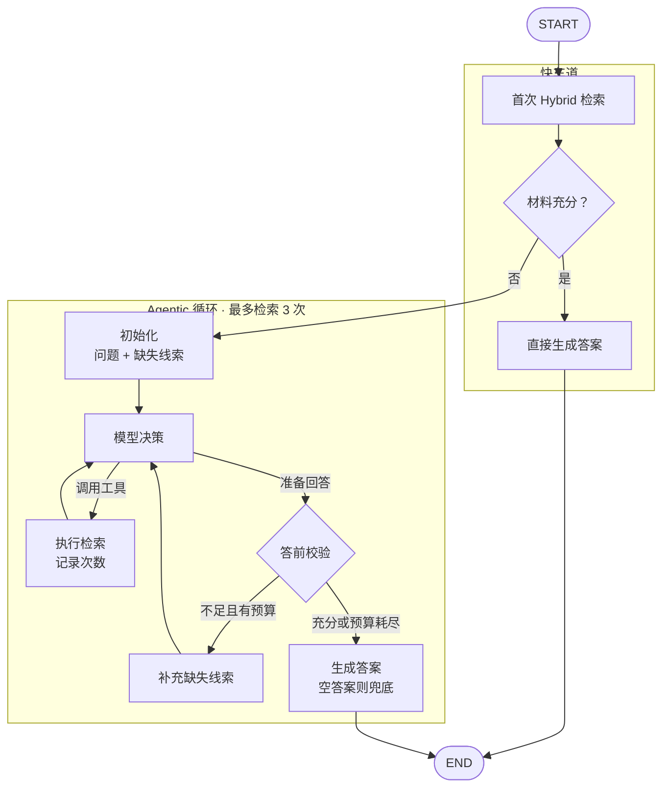

## 一、langchain 对 Agentic RAG 的定义
#### 1.1 Agent 先判断是否需要检索向量数据库
- 代理式检索增强生成 (**Agentic RAG**) 将检索增强生成的优势与基于智能体的推理相结合。智能体（由 LLM 驱动）不会在回答前预先检索文档，而是在交互过程中进行分步推理，并自行决定何时以及如何检索信息
![[Pasted image 20260731152055.png|277]]

#### 1.2 Agent 先增强问题、然后检索、再判断
核心节点：
- **Query enhancement（查询增强）[[RAG在终端前端的应用实践]]**：修改输入的问题以提升检索质量。这可以通过重写模糊查询、生成多个变体，或利用额外上下文来扩展查询来实现
- **Retrieval validation（检索验证）**：评估所检索到的文档是否相关且充足。如果不是，系统可能会优化查询并再次检索。
- **Answer validation（答案验证）**：检查生成的答案是否准确、完整并与源内容一致。如有必要，系统可以重新生成或修改答案
![[Pasted image 20260731152410.png|178]]
## 二、Agentic RAG 的优势与劣势
#### 2.1 Agentic RAG 的优势
- **多挑推理问题**：例如对比 A 公司和 B 公司的营收，**此时需要模型会拆解问题**，再分别检索
- **检索结果不相关时的自救**：例如：苹果公司最新的新消息，向量检索可能会找出苹果水果相关的信息，**此时需要模型纠错**并重新查询
- **需要调用工具而不仅仅是查文档**：例如：根据这份合同，违约金按日利率0.05%计算，拖欠了45天，金额10万，该赔多少？**此时需要模型调用计算工具**再结合检索结果回复

#### 2.2 Agentic RAG 的劣势
- **延迟和成本高**：调用模型需要成本和时间，RAG 一次检索加生成 1～2 秒，Agentic RAG 需要更长的时间
- **简单问题上没有优势**：比如查一个产品参数、查一条法规原文——普通 RAG 检索准确率本来就很高，根本不需要"多想"
- **系统稳定性和可调试性差**:普通 RAG 出了问题容易定位是检索环节还是生成环节；Agentic RAG 是一条多步决策链，本身带有一定的不确定性
- **工程复杂度增加**：设计终止检索循环，防止死循环、防止无限重试烧钱。检索结果"够不够"的判断标准是什么。多个工具之间怎么调度。成本上限怎么控制

#### 2.3 RAG 和 Agentic RAG 应该怎么选

**RAG 适合场景**
- 单一知识库、事实性问答、FAQ 这类场景
- 对响应速度要求高的场景，比如客服、实时对话
- 成本和延迟敏感、问题相对简单的场景

**Agentic RAG 适合场景**
- 需要多跳推理、跨文档综合的场景
- 需要调用计算、数据库、API 等外部工具的场景
- 查询模糊、需要澄清意图的场景

两者结合混合架构，判断用户问题的复杂度、置信度，决定走普通 RAG 或 Agentic RAG

## 三、代码层面实现的 Agentic RAG
#### 3.1 核心循环图

#### 3.2 代码层面解读
**基于 langgraph 实现节点、无条件边、有条件边、循环、结束节点**。接下来讲讲核心思路：
- **首先**拿到用户问题，先进行一次检索
- **然后**判断检索结果是否能够足够回复用户问
- 假设能回复用户问题则直接结束，假设不能回复用户问题则进入 Agentic RAG 检索流程
- **接着**进入 Agentic RAG 检索时携带缺失的线索，由模型判断，应该调用工具还是直接回复
- **其次**模型不进行工具调用时，进入到回复前的最后一个检查环节
- **接下来**如果材料充分或者检索次数达限制，则结束流程；否则继续进入模型流程
- **最后**生成回复内容或检索次数达到限制的说明

当前系统设置有两个判断节点：
1. 模型的第一次检索是否足够回复
2. 模型进入 Agentic RAG 检索系统循环时，判断是否足够回复用户问题
如果不满足回复用户问题的检索材料时，都会携带缺失的具体信息，然后再交给**检索模型**，由检索模型来判断如何去拆解问题，然后进行多次检索。检索模型不再调用工具时，将这个答案再次交给**判断模型**，由判断模型来判断材料是否充分。**如果充分，那就回复内容；如果不充分，就继续检索**


```ts
import { StateGraph, START, END } from "@langchain/langgraph";
import { makeGraphNodes } from "./nodes.js";

const n = makeGraphNodes(store, keyword);
const graph = new StateGraph(GraphState)
// 节点
.addNode("fastRetrieve", n.fastRetrieve) // 拿到用户问题先检索数据库获取相关信息
.addNode("fastJudge", n.fastJudge) // 输入用户问题 + 第一次检索信息， 判断当前检索信息是否足够回复用户问题，并给出不充分的理由或缺少的必要信息
.addNode("fastGenerate", n.fastGenerate) // 第一次检索足够回复用户信息时，使用检索信息回复用户问题，流程结束
.addNode("agentInit", n.agentInit) // 组装系统提示词（你是XX，你可以调用检索工具） + 用户输入 + 初步检索后还缺的物料或信息
.addNode("agentModel", n.agentModel) // 模型节点：具备search工具，传入state保存的信息，要么调用工具继续检索；要么直接回复用户问题
.addNode("toolsNode", n.toolsNode) // 工具节点：实际执行search的节点，支持检索以及记录检索了多少次，超出3次限制则不继续检索
.addNode("agentCheck", n.agentCheck) // 最终回复先校验节点：输入用户问题 + 检索结果 判断当前材料是否足够回复用户问题
.addNode("continueSearch", n.continueSearch) // 继续检索节点：返回上一轮模型判断当前材料不满足回复用户问题时的缺少信息，目的是再下轮时能拿着缺少的信息再次检索
.addNode("finalize", n.finalize) // 结束节点：假设最后一轮agent没有回复，此时结束节点会再生成一轮结果；并给出正常结束或调用检索工具达到上限的被迫结束
// ── 快车道 + 升级闸门 ──
.addEdge(START, "fastRetrieve") // 设置graph的起点
.addEdge("fastRetrieve", "fastJudge") // 设置无条件边：第一次检索 -> 判断检索材料是否够回复用户问题
.addConditionalEdges("fastJudge", n.gateRoute, {
// 设置有条件边；从第一次检索条件判断 -> 材料充分则生成回复 ；从第一次检索条件判断 -> 材料不充分则升级为agentic
fast: "fastGenerate", // 材料充分 → 快车道生成
agentic: "agentInit", // 不充分 → 升级 agentic
})
.addEdge("fastGenerate", END) // 无条件边：第一次生成回复 -> graph结束
// ── agentic 循环 ──
.addEdge("agentInit", "agentModel") // 无条件边：拼装系统提示词 -> 模型节点
.addConditionalEdges("agentModel", n.agentRoute, {
// 有条件边：判断是否需要调用工具，模型节点 -> 调用工具；或 模型节点 -> 回复前再检查节点
tools: "toolsNode", // 想调工具 → 执行检索（带预算）
check: "agentCheck", // 想落笔 → 先做答前校验
})
.addEdge("toolsNode", "agentModel") // 检索完回到模型 无条件边：工具节点 -> 模型节点
.addConditionalEdges("agentCheck", n.checkRoute, {
// 有条件边：回复前检查 -> 通过则复回。或 回复前检查 -> 未通过则继续循环检索
finalize: "finalize", // 充分 / 预算耗尽 → 收尾
continue: "continueSearch", // 不足且有预算 → 打回继续搜
})
.addEdge("continueSearch", "agentModel") // 无条件边；继续循环节点 -> 模型调用节点
.addEdge("finalize", END); // 无条件边：结束

return graph.compile(); // 编译为图结构
}
```
